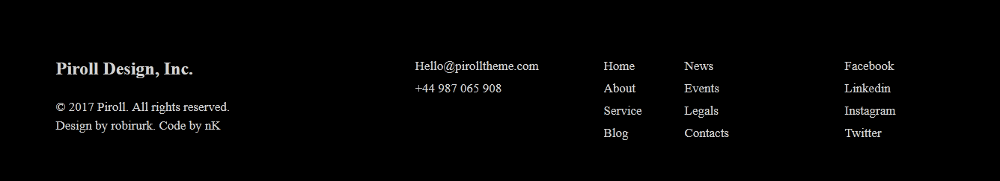

<h1 align="center">Clone Website Design</h1>

Here i have cloned a website design and it looks same except some images[i have used from my own] to html which includes 5 section and each with nice animation

## Sections

-  Hero Srction
-  About Srction 
-  Product Section
-  Call to Action Srction
-  Footer Srction

# How to see the design

-  download files above and unzip 
-  Double click on .html extension file

# Contact & social

- **[Facebook](https://www.facebook.com/safahait.sawon)**
- **[Github](https://github.com/Safayet-Shawn/)**
- **[Gmail:safayetshawn95@gmail.com](safayetshawn95@gmail.com)**
- **[Phone :01726681903](01726681903)**
 
# Screenshots

